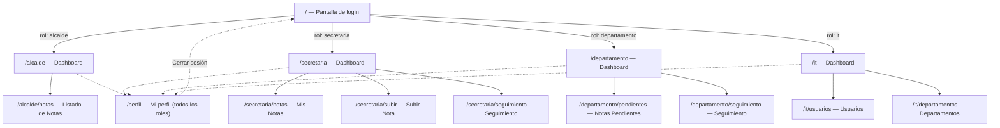

# Mapa de navegación
## Sistema de Ayuda Social — Alcaldía Municipal

---

## 1. Diagrama de navegación por rol

Las líneas punteadas (`-.->`) indican una navegación disponible desde el
menú de usuario, no desde el menú lateral principal.

---

## 2. Navegación común a todos los roles

Estos elementos están disponibles sin importar el rol con el que se haya
iniciado sesión:

- **Encabezado superior**: icono de notificaciones y menú de usuario
  (avatar) con dos opciones: **Mi perfil** y **Cerrar sesión**.
- **Barra lateral (sidebar)**: lista de navegación específica del rol (ver
  diagrama). En pantallas pequeñas, la barra lateral se colapsa y se
  reemplaza por un menú accesible mediante un botón en el encabezado.
- **Mi perfil** (`/perfil`): pantalla para editar nombre y apellido,
  disponible para los 4 roles.

---

## 3. Pantallas

### Rol: Alcalde
1. `/` — Pantalla de login (antes de iniciar sesión).
2. `/alcalde` — Dashboard del alcalde.
3. `/alcalde/notas` — Listado de notas pendientes de firma.
4. Modal de detalle de una nota (abrir desde el listado).

### Rol: Secretaría
5. `/secretaria` — Dashboard de secretaría.
6. `/secretaria/subir` — Formulario de registro de una nueva nota, vacío.
7. `/secretaria/subir` — Mismo formulario con el archivo adjunto ya
   seleccionado (vista previa del archivo).
8. Pantalla de confirmación con el radicado generado, tras guardar.
9. `/secretaria/notas` — Listado de notas con filtros aplicados.
10. `/secretaria/seguimiento` — Vista de seguimiento general.
11. Modal de trazabilidad/historial de una nota.

### Rol: Departamento
12. `/departamento` — Dashboard del departamento.
13. `/departamento/pendientes` — Listado de notas pendientes de revisión.
14. Modal de detalle de una nota desde el departamento.
15. Modal de **aprobación** de una nota (antes de confirmar).
16. Modal de **rechazo** de una nota, con el campo de motivo lleno.
17. `/departamento/seguimiento` — Vista de seguimiento del departamento.

### Rol: Operador IT / Administrador
18. `/it` — Dashboard de administración (solo métricas de usuarios).
19. `/it/usuarios` — Listado de usuarios, con los filtros visibles.
20. Modal de creación de un nuevo usuario, vacío.
21. Modal de edición de un usuario existente, con datos precargados.
22. `/it/departamentos` — Listado de departamentos.

### Pantallas comunes
23. `/perfil` — Pantalla de "Mi perfil" (puede capturarse con cualquier
    rol).
24. Menú de usuario abierto (mostrando "Mi perfil" y "Cerrar sesión").
25. Vista en un viewport móvil (sidebar colapsada) de cualquiera de los
    dashboards, para evidenciar el diseño responsivo.